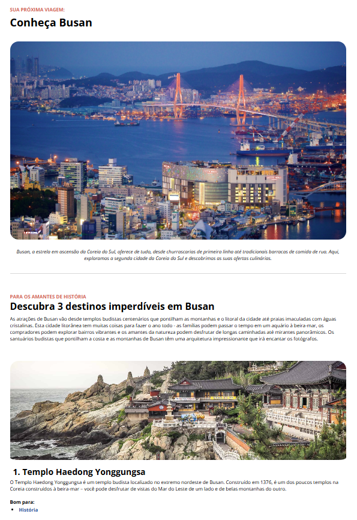

# Desafio Prático – Local Turístico

Projeto desenvolvido como parte da formação **Full Stack Front-End** da [Rocketseat](https://www.rocketseat.com.br/), com o objetivo de praticar a construção de uma landing page sobre um destino turístico.

## ✨ Tecnologias utilizadas

- HTML5
- CSS3

## 💡 Objetivo do projeto

Criar uma página informativa e responsiva apresentando um local turístico, explorando aspectos visuais, organização semântica do conteúdo e boas práticas de estruturação de código.

## 📸 Preview

---

Projeto desenvolvido durante o curso da Rocketseat 🚀
